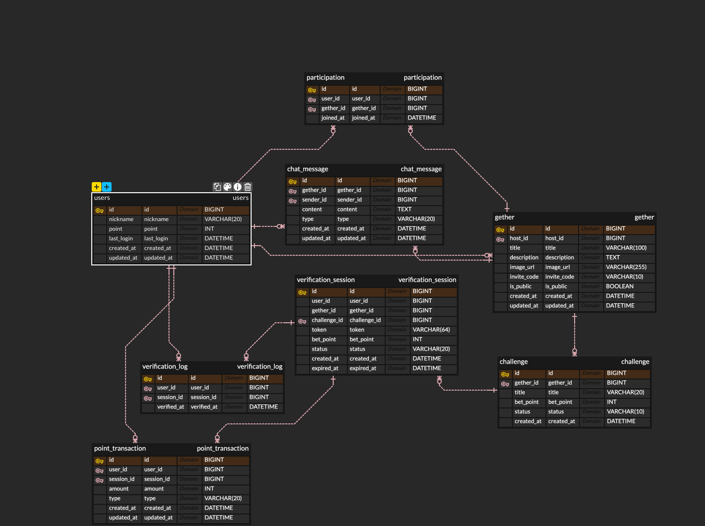

# 배포 (AWS EC2 & RDS)

### 시스템 아키텍처 (System Architecture)
* **Cloud Hosting**: AWS EC2 (Amazon Linux 2023)
* **Domain & DNS**: 가비아(Gavia) 네임서버 설정을 통한 커스텀 도메인(`www.betgether-api.shop`) 운용
* **Web Server**: Nginx (Reverse Proxy)
* **SSL/TLS**: Certbot (Let's Encrypt)을 통한 HTTPS 보안 통신 구축
* **Application**: Spring Boot 3.5.9 (Java 21)

#### 환경 변수를 활용한 민감 정보 보호
DB 주소, 계정 정보, JWT Secret Key 등 민감한 정보를 소스 코드에 포함하지 않고 시스템 환경 변수(`.bashrc`)를 통해 주입했습니다.

### 📊 데이터베이스 설계 (ERD)

---

# 전역 사용 도메인
## JwtProvider

사용자 확인을 위한 Jwt 토큰을 생성, Jwt 토큰으로부터 유저 ID 조회를 담당합니다.

```java
    public String generateAccessToken(long userId, String nickname) {
        long now = System.currentTimeMillis();
        return Jwts.builder()
                .subject(String.valueOf(userId))
                .claim("nickname", nickname)
                .issuedAt(new Date(now))
                .expiration(new Date(now + expiryMillis))
                .signWith(key)
                .compact();
    }
```

사용자 ID, nickname을 포함하여 토큰을 생성하고 토큰으로부터 유저 ID를 얻을 수 있습니다.

## Interceptor

요청이 들어올 때 받는 token으로부터 userId를 얻고 이를 Attribute에 세팅하는 인터셉터입니다.

```sql
String token = auth.substring(7);
long userId = jwtProvider.getUserId(token);
request.setAttribute("userId", userId);
```
---

# 도메인 : chat

## 이전 채팅 내역 조회
채팅 화면에 들어갔을 때 과거의 채팅 내역을 조회합니다.

### 주요 코드
```java
// ChatMessageRepository.java
@Query("SELECT c FROM ChatMessage c " +
       "JOIN FETCH c.sender " + // N+1 문제 방지를 위한 패치 조인
       "WHERE c.gether.id = :getherId " +
       "AND (:cursor IS NULL OR c.id < :cursor) " + // 커서 기반 조건문
       "ORDER BY c.id DESC")
Slice<ChatMessage> findChatHistory(@Param("getherId") Long getherId, 
                                   @Param("cursor") Long cursor, 
                                   Pageable pageable);
```
* 성능 최적화
  * `c.id < :cursor` 조건을 통해 인덱스를 활용하여 필요한 구간의 데이터만 즉시 조회합니다. 이는 수백만 건의 데이터가 쌓여도 동일한 응답 속도를 보장합니다.

* N+1 문제 해결 (JOIN FETCH)
  * 채팅 메시지를 가져올 때 발신자(User) 정보를 각각 쿼리하지 않고, `JOIN FETCH`를 통해 한 번의 쿼리로 가져와 DB 부하를 최소화했습니다.

* Slice 인터페이스 활용
  * 전체 데이터 개수를 세는 Count 쿼리를 생략하고, "다음 페이지 존재 여부"만 판단하는 `Slice`를 사용하여 무한 스크롤 환경에 최적화된 성능을 구현했습니다.
---

# 도메인 : auth

* 서비스 진입 시 로그인 로직을 전담합니다.

```java
@Transactional
    public LoginResponse login(LoginRequest request) {
        String nickname = request.nickname();
        User user = userRepository.findByNickname(nickname)
                .orElseGet(()-> userRepository.save(
                                    User.builder().nickname(nickname).point(500)
                                            .lastLogin(now())
                                            .build()));
			  if (user.isFirstLoginToday(now())) {
            user.addPoint(50);
        }
```

* 요청받은 닉네임으로 로그인 / 회원가입을 시도합니다. 
* DB에 해당 유저(닉네임)이 있다면 기존의 유저 ID를, 해당 유저(닉네임)이 없다면 DB에 새로운 유저를 만들고 새롭게 만든 유저 ID를 응답합니다.

* 해당 유저가 오늘 처음 로그인이라면 출석 포인트 50포인트를 지급합니다. (당일 회원가입 유저 제외)

---
# 도메인 : gether

* 서비스 주요 기능인 Gether와 관련된 로직을 전담합니다.

  * Gether의 생성, 조회, 가입 등 다양한 기능을 담당합니다.

## Gether 생성

* Gether 를 생성합니다. 생성 요청한 유저가 Host가 되어 Gether에 자동 참여됩니다. 이후 다양한 로직에서 예외 케이스 발생 확률을 줄입니다.

```java
  gether.setChallenge(ch);
  getherRepository.save(gether);
  
  // 호스트도 해당 게더에 자동 참여 처리
  try {
      participationRepository.save(
              Participation.builder().user(host).gether(gether).build()
      );

```

## 공개 Gether 키워드 검색

* Gether 의 title과 description에서 요청받은 keyword로 검색하여 나온 Gether들을 반환합니다.

```java
  where g.isPublic = true and (:keyword is null or :keyword = '' 
                 or lower(g.title) like lower(concat('%', :keyword, '%'))
                 or lower(g.description) like lower(concat('%', :keyword, '%')))
  group by g.id, g.title, g.description, g.imageUrl, g.createdAt, c.title
  order by g.createdAt desc
```

* 키워드를 받지 않아도 같은 방식으로 처리 가능합니다.

## 내가 속한 Gether 목록 조회

* 유저가 참여한 게더 목록을 조회합니다. 해당 게더에서 현재 배팅이 진행중인지 여부도 함께 조회하여 반환합니다.

```java
  case
      when c is null then null
      when exists (
          select 1
          from VerificationSession s
          where s.challenge = c
            and s.status = 'ACTIVE'
            and s.expiredAt > CURRENT_TIMESTAMP
      ) then 'OPEN'
      else 'CLOSED'
  end
```

## Gether 가입

* Gether Id로 공개되어있는 Gether 를 가입하거나, 초대 코드를 이용해 검색에서 숨겨진 Gether 에 가입할 수 있습니다.

```java
  if (participationRepository.existsByUser_IdAndGether_Id(userId, getherId)) {
              return new GetherJoinResponse("ALREADY_JOINED", getherId);
  }
  
  try {
      Participation participation = Participation.builder().user(user).gether(gether).build();
      participationRepository.save(participation);
      return new GetherJoinResponse("JOINED", getherId);
  } catch (DataIntegrityViolationException e) { // 동시성으로 이미 가입 처리
      return new GetherJoinResponse("ALREADY_JOINED", getherId);
  }
```

* 동시성 예외를 두어 중복 가입을 방지합니다.

* 초대코드 가입 방식은, 초대코드로 Gether 를 조회하여 가입 처리합니다.

## Gether 수정

* Gether의 요소들을 수정할 수 있습니다. 해당 작업은 Gether 를 만든 Host 만 가능하도록 제한합니다.

```java
  if (!gether.getHost().getId().equals(userId)) {
      throw new IllegalStateException("호스트만 게더 수정 가능");
  }   
```
---
# 도메인 : ranking

* 서비스 내 랭킹 조회과 관련된 로직을 담당합니다.

  * 유저의 포인트를 기준으로 전체 랭킹을 계산하고, Top3 / Top20 / 내 랭킹을 한번에 반환합니다.

## 랭킹 조회

```java
  List<RankingItemResponse> all = userRepository.findTopRanking(20).stream()
                  .map(v -> new RankingItemResponse(v.getRnk(), v.getNickName(), v.getPoint()))
                          .toList();
  
  List<RankingItemResponse> top3 = all.stream().limit(3).toList();
  
  RankingItemView myView = userRepository.findMyRanking(userId);
  RankingItemResponse my = (myView == null) ? null : new RankingItemResponse(myView.getRnk(), myView.getNickName(), myView.getPoint());
  return new RankingResponse(top3, all, my);
```

* Top20을 조회하고 이를 바탕으로 Top3까지 추가 DB 조회 없이 구성할 수 있습니다.
  * 내 랭킹은 20위권 밖일 수 있기 때문에 따로 조회합니다.

* 이를 바탕으로 3개의 정보를 묶어 Response로 반환합니다.
---
# 도메인 : verification

* Gether의 **QR 인증 세션(VerificationSession)** 흐름과 **배팅 포인트 정산**을 담당합니다.

* 방장이 인증을 시작하면 세션이 열리고(토큰 발급) 
  * 참여자들이 스캔으로 인증을 완료한 뒤 
    * **만료 시점(또는 전원 인증 완료 시점)** 에 자동 정산됩니다.

* 정산 결과는 **PointTransaction(포인트 거래 내역)** 으로 기록됩니다.

## 인증 시작

* 방장이 인증을 시작합니다. 
  * 권한 검증 
  * ACTIVE 세션 중복 방지
  * VerificationSession 생성 
  * Gether 내의 모든 참가자로부터 배팅금 차감 
  * 채팅방 알림 등의 기능을 수행합니다.

```java
  // 1) 방장 권한 검증
  if (!gether.getHost().getId().equals(hostUserId)) {
      throw new IllegalStateException("방장만 인증을 시작할 수 있음.");
  }
  
  // 2) ACTIVE 세션 중복 방지
  sessionRepository.findFirstByGetherIdAndStatusOrderByCreatedAtDesc(getherId, "ACTIVE")
      .ifPresent(active -> { throw new IllegalStateException("이미 진행중인 인증 세션 존재"); });
  
  // 3) 세션 생성 + 저장
  VerificationSession session = VerificationSession.builder()
      .hostUserId(hostUserId)
      .getherId(getherId)
      .challenge(challenge)
      .token(generateToken())
      .betPoint(betPoint)
      .status("ACTIVE")
      .createdAt(now)
      .expiredAt(expiredAt)
      .build();
  sessionRepository.save(session);
  
  // 4) 멤버 포인트 차감 + BET 트랜잭션 기록
  List<User> members = userRepository.findAllByIdInForUpdate(memberIds);
  members.forEach(u -> u.addPoint(-betPoint));
  pointTransactionRepository.saveAll(debits);
  
  // 5) 채팅 알림(VERIFY_START)
  ChatSendResponse response = chatService.saveMessage(... ChatType.VERIFY_START ...);
  messagingTemplate.convertAndSend("/sub/chat/room/" + getherId, response);
```

* 인증을 위한 토큰은 SecureRandom + URL-safe Base64으로 랜덤 생성합니다.

```java
  private static String generateToken() {
      byte[] bytes = new byte[18];
      new SecureRandom().nextBytes(bytes);
      return "VBT-" + Base64.getUrlEncoder().withoutPadding().encodeToString(bytes);
  }
```

## 인증 스캔

* 방장이 올린 QR코드를 일반 유저 (Gether 참여자)가 스캔하여 배팅에 참여합니다.

```java
  // 멤버 검증
  if (!participationRepository.existsByUser_IdAndGether_Id(userId, getherId))
      throw new IllegalStateException("게더 멤버만 인증할 수 있습니다.");
  
  // 토큰 세션 검증
  VerificationSession session = sessionRepository.findByToken(verifyToken)
      .orElseThrow(() -> new IllegalArgumentException("유효하지 않은 토큰입니다."));
  if (!session.getGetherId().equals(getherId)) throw new IllegalArgumentException("게더 정보 불일치");
  if (!session.isActive()) throw new IllegalStateException("이미 종료된 인증입니다.");
  if (session.isExpired(now)) { session.markExpired(); throw new IllegalStateException("인증 시간이 만료되었습니다."); }
  
  // 로그 저장(중복 인증 방지)
  try {
      logRepository.save(VerificationLog.builder().userId(userId).sessionId(session.getId()).build());
  } catch (DataIntegrityViolationException e) {
      throw new IllegalStateException("이미 인증을 완료했습니다.");
  }
  
  // 전원 인증 시 즉시 정산
  long totalMemberCount = participationRepository.countByGether_Id(getherId);
  long successCount = logRepository.countDistinctUserIdBySessionId(session.getId());
  
  // 방장 항상 포함(로그에 없으면 +1로 처리)
  if (session.getHostUserId() != null && !logRepository.existsBySessionIdAndUserId(session.getId(), session.getHostUserId())) {
      successCount += 1;
  }
  if (successCount >= totalMemberCount) {
      settleSession(session, challenge);
  }
```

* Gether 멤버인지 검증, token으로 session 조회와 GetherId와 일치하는지 검증, 세션의 만료 여부 등을 수행합니다.

* 만약 Gether 의 모든 구성원이 인증하였다면 즉시 정산을 시작합니다. 방장은 항상 정산에 포함하도록 하였습니다.

## 만료 세션 자동 정산 스케줄러

```java
  @Scheduled(fixedDelay = 10000)
  @Transactional
  public void settleExpiredSessions() {
      List<VerificationSession> expiredSessions = sessionRepository.findExpiredActiveSessions(LocalDateTime.now());
      for (VerificationSession session : expiredSessions) {
          Challenge challenge = challengeRepository
                  .findByGether_IdAndStatus(session.getGetherId(), ChallengeStatus.OPEN)
                  .orElseThrow(() -> new IllegalArgumentException("진행중인 챌린지 없음"));
          settleSession(session, challenge);
      }
  }
```

* 10초마다 시간이 지나 만료되어있는 ACTIVE Session을 조회하여 정산합니다.

## 정산 로직

* 중복 정산을 방지하는 로직이 있습니다.

```java
  int updated = sessionRepository.closeIfActive(session.getId());
  if (updated == 0) return; // 이미 다른 트랜잭션이 닫았음 → 중복 정산 방지
```

* VerificationLog에 기록된 UserId들을 승자로 간주합니다.
* 중복 제거 후 해당 유저들을 대상으로 정산을 진행합니다.
* 총 배팅금을 승자 수로 나누어 정산을 진행합니다. 
  * 만약 전원 인증한다면 원금 + 50 포인트를 추가 지급합니다.

```java
  List<Long> successUserIds = logRepository.findUser_IdsBySession_Id(session.getId());
  if (successUserIds == null) successUserIds = new ArrayList<>();
  if (session.getHostUserId() != null) successUserIds.add(session.getHostUserId());
  
  List<Long> winners = successUserIds.stream().distinct().sorted().toList();
  List<User> users = userRepository.findAllByIdInForUpdate(winners);
  
  long totalPoint = totalMemberCount * betPoint;
  int winnerCount = users.size();
  long base = totalPoint / winnerCount;
  
  boolean allParticipated = (winnerCount == totalMemberCount);
  int bonus = allParticipated ? bonusPoint : 0;
  
  long payout = base + bonus; // 각 승자 지급액
```

* 정산 진행 후 결과를 저장합니다. PointTransaction에 정산 내역을 저장합니다.

```java
  List<PointTransaction> credits = users.stream().map(u -> {
              long payout = base + bonus;
              u.addPoint((int) payout);
              return PointTransaction.builder()
                      .type(PointTransactionType.SETTLED)
                      .amount((int) payout)
                      .session(session)
                      .user(u)
                      .build();
          }).collect(Collectors.toList());
  
          userRepository.saveAll(users);
          pointTransactionRepository.saveAll(credits);
```

---
# 개선사항
## GlobalExceptionHanlder의 부재
* 개발 초기, 개발 속도에만 집중하다보니 Exception Handler를 따로 만들지 않고 예외를 throw하면서 진행하였습니다.
* 개발 볼륨이 커지면서 점점 예외 처리 분기가 많아졌고 이를 구분해야할 필요가 생겼습니다.
* 하지만 모두 같은 500 server Error로만 보여 정확히 무슨 에러인지 확인하는데에 어려움이 생겼습니다.
* 추가로 로컬 환경이 아니라 배포 환경으로 진행될수록 에러 확인이 더욱 힘들어졌고 개발 속도에도 큰 영향이 있었습니다

* 추후에 같은 상황이라면 global exception handler와 custom exception code 도입을 적극 추진해야할 필요성을 느꼈습니다.